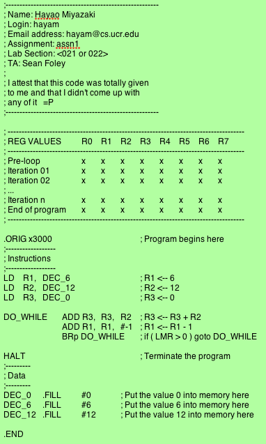
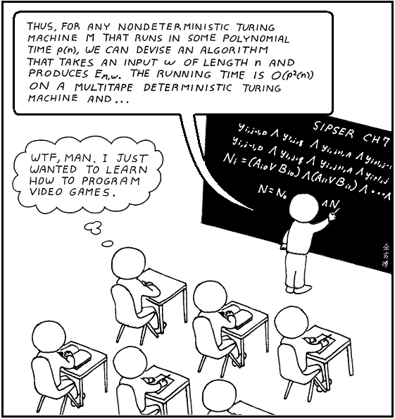

# CS061 - Programming Assignment 1

## Objective

The purpose of this assignment is to familiarize you with the basics of LC-3 assembly language programming, the LC3Tools editor and emulator, and rudimentary debugging.

## Your Tasks

Implement the LC-3 program from the image below.

**Note:** This is *almost*, but not *quite*, the same program you worked on in Lab 1: it uses a DO-WHILE loop to multiply one number by another by repeated adding.

First (as with all your labs and assignments) go to the Assignments page in [Canvas](https://elearn.ucr.edu), and under Programming Assignments download the assignment 1 zip file to your assignments/assn1 folder in
your cs account, and unzip it in place.

Type the code from the image below into your assignment1.asm file using the LC3Tools editor (see instructions below).

*Again, the registers are assigned differently from your Lab 1 exercise, so don't copy that! **But** do use the (AND with 0) technique discussed in the "TIP" paragraph in lab 1.* 

To edit and run your code, launch the LC3Tools application. If you have not already installed LC3Tools, you can find it for your platform on Canvas on the LC3Tools page. Navigate to the application (LC3Tools.exe on
Windows, LC3Tools on Mac and LC3Tools-2.0.1-AppImage on Linux) and launch it. In the Editor tab of the program and open the code in the file called assignment1.asm.

Once you have completed the code, press the wrench icon to assemble your program. When the program is assembled with no syntax errors, go to the Simulator tab to run your program.

***Remember:** whenever you run simpl, you must ALWAYS keep the Text Window open so you can see warnings & error messages from the emulator!*

Now place a _breakpoint_ at the _beginning_ of the DO-WHILE loop by clicking the exclamation point (AKA bang) inside a hexagon next to the DO_WHILE label.

Now, when you press the "Run" button (it looks like a play button), LC3Tools will execute each line of code until it reaches the breakpoint, where it will pause and wait for you to press Run again; it will continue doing this until it no longer encounters the breakpoint, at which time it will continue executing until the HALT instruction.

Lastly, create a table in your .asm file (see the image below) to record the register contents for each register (R0 through R7) as you repeatedly press the Run button and iterate through the loop, as follows:
- Before entering the loop (i.e. the first time the program halts at the breakpoint)
- After each iteration of the loop (each subsequent breakpoint pause)
- Note that since your breakpoint is at the start of the loop, the register values after the _last_ iteration will just be the values when the program has ended, as suggested by the naming of the last row in the image below.

***Before you run the code, try to answer this question:** How many rows do you think you will end up with in your table?*

Format your table like the one in the image below (but obviously reporting the actual values from ALL eight registers, for ALL iterations of the loop!)

The following program performs the action:
```asm
R3 <-- 12 * 6; (i.e. multiply 12 by 6 and write the result into Register 3)
```
using the equivalent of a DO-WHILE loop:



**Remember:** Replace the instruction that zeros out R3 with the AND technique you learned in lab 1!

## Submission Instructions

Submit your **assignment1.asm** file _(and ONLY that file!)_ to the Programming Assignment 1 folder in Gradescope.

Note that there is no autograding for this assignment - you will be notified when it has been graded manually.

## Rubric
- There is nothing for you to actually get wrong in this assignment (we give you the code!) - so the only way to mess up and lose points would be to fail to follow instructions. **So get into the habit of reading the instructions fully & carefully :)**
- This assignment has to be graded manually (i.e. we have to look at your code formatting and your register table); we will try to grade submissions at least once or twice a day. So don't leave it to the last day - you may need a second chance!! See the point above!
- For this and all assignments, use of the template given to you is required.

### Comics??!Sweet!!!


 
Source: [https://xkcd.com/](https://xkcd.com/)